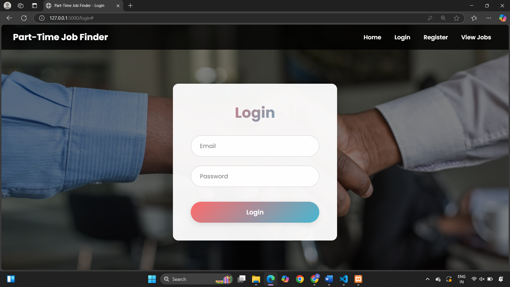
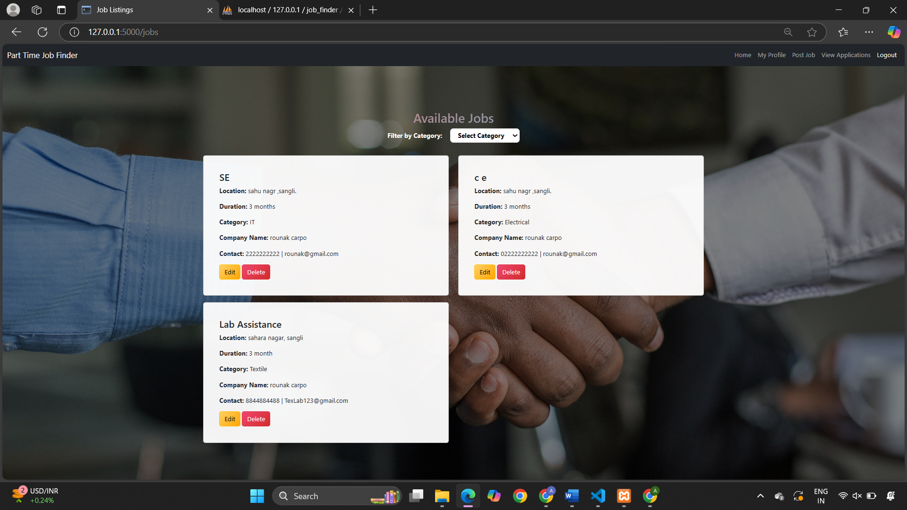

# Part-Time Job & Gig Finder

A web application that connects **employers** and **job seekers** for part-time jobs and gigs.  
Employers can post jobs, and employees can search, filter, and apply for relevant opportunities.

---

## ✨ Features

- 🔐 **User Authentication** (Register/Login)
- 📝 **Employers** can post jobs with title, description, pay, location, and category
- 🎯 **Employees** can browse, filter, and apply for jobs
- ⚡ Real-time job listing updates using **AJAX**
- 📂 Resume upload feature for job seekers
- 🔒 Secure password storage with hashing
- 🗂️ Category-based job filtering:
  - IT
  - Mechanical
  - Civil
  - Electrical
  - Textile
  - Regular

---

## 🛠️ Tech Stack

**Frontend**  
- HTML, CSS, JavaScript, Bootstrap  

**Backend**  
- PHP & MySQL (XAMPP)  
- Python & Flask (in-progress alternate backend)  

**Database**  
- MySQL  

---

## 🚀 Getting Started

### Prerequisites
- Install [XAMPP](https://www.apachefriends.org/) (for PHP + MySQL)
- Install [Python](https://www.python.org/) (if using Flask version)
- Git installed locally

### Setup Steps
1. Clone the repository:
   ```bash
   git clone https://github.com/ANIKET0935/part-time-job-and-gigs-finder.git
   cd part-time-job-and-gigs-finder
## 📸 Screenshots

### 🔑 Login Page
<p align="center">
  
</p>

### 📝 Register Page
<p align="center">
  
</p>

### 📂 Dashboard
<p align="center">
  
</p>

### 💼 Job Listings
<p align="center">
  
</p>
